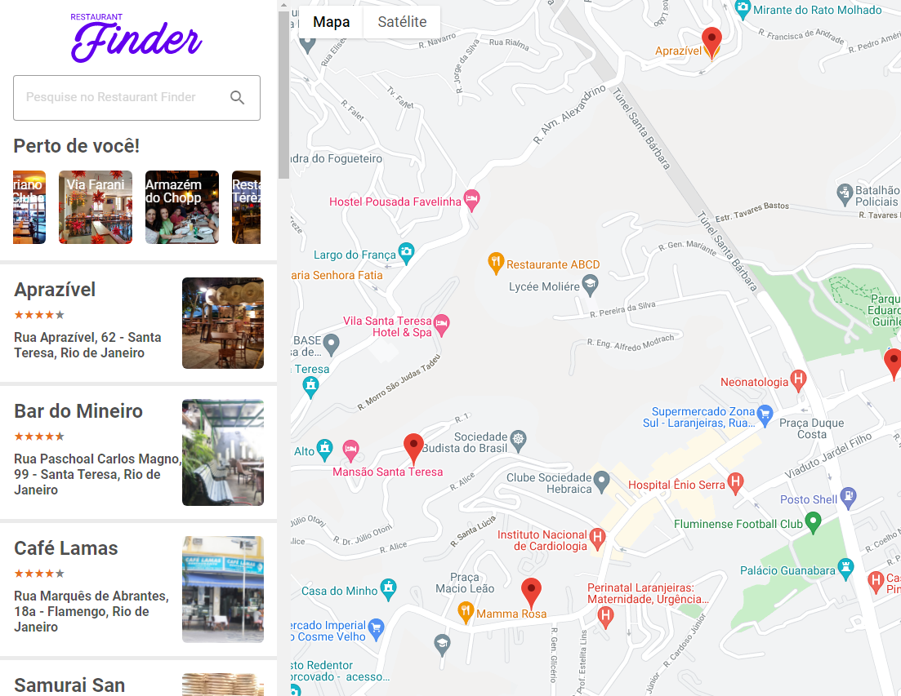

<h1 align="center">
    
</h1>

<p align="center">
  
</p>

## 💻 Projeto Restaurant Finder

Projeto desenvolvido na plataforma do **[Digital Innovation](https://digitalinnovation.one/)**, realizado sobre a mentoria do professor Patrick Narciso.

<p>Tem o Objetivo de buscar restaurantes próximos utilizando o  Google Maps API.</p>


<p align="center">
  
</p>


## 🚀 Tecnologias

 >>[Node.js](https://nodejs.org/en/)   >>[React](https://reactjs.org) >>[Google Maps API](https://www.npmjs.com/package/@react-google-maps/api) >>[React-Lottie](https://www.npmjs.com/package/react-lottie)  >>[React-Slick](https://www.npmjs.com/package/react-slick) >>[Styled-Component](https://styled-components.com/docs/basics)

## 📝 Licença 

Esse projeto está sob a licença MIT. Veja o arquivo [LICENSE](LICENSE.md) para mais detalhes.

---

```bash

# Clone o repositório
$ git clone https://github.com/arthurfortunato/find-the-restaurant.git

# Acesse a pasta do projeto no prompt de comando
$ cd find-the-restaurant

# Instale as dependências
$ npm install

# Será necessário criar um arquivo .env na raíz da aplicação e colocar a seguinte informação 
# REACT_APP_GOOGLE_API_KEY=CHAVE DE ACESSO 
$ Para conseguir a chave de acesso é só entrar em na plataforma Google Maps API(https://developers.google.com/maps)

# Execute o script "start"
$ npm start

# O projeto inciará na porta: 3000 - acesse http://localhost:3000 


---
